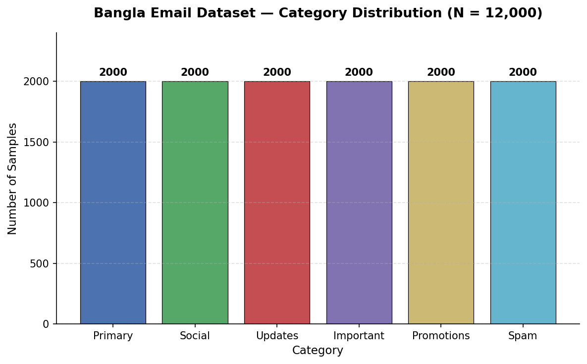

# Bangla Email Classification Dataset

*A human-annotated, survey-collected corpus of real Bangla email and SMS text for classification research.*

---

## Abstract

This repository presents a Bangla-language email/SMS classification dataset comprising 12,000 labeled samples across six categories. Unlike synthetically generated or scraped corpora, this dataset was constructed through a structured survey administered to real respondents, both **in-person (offline)** and **through a digital form (online)**, with participants submitting authentic messages they had personally received. The resulting corpus is intended to support research in Bangla natural language processing (NLP), including but not limited to spam detection, email categorization, and low-resource language text classification.

## 1. Data Collection Methodology

Data was gathered through a purpose-built survey instrument distributed via Google Forms, supplemented by offline collection in cases where respondents preferred to submit samples in person. Respondents were asked to provide the raw text of an email or SMS message they had genuinely received, along with the category that best described it. No message text was synthetically generated, paraphrased, or augmented by automated tools — every sample reflects naturally occurring, real-world Bangla communication.

**Survey instrument:** [https://forms.gle/dqdZ24o2gto5aPnw6](https://forms.gle/dqdZ24o2gto5aPnw6)

This dual-channel (online + offline) approach was adopted to reduce sampling bias toward digitally active respondents and to capture a broader demographic range of authentic message styles.

## 2. Dataset Structure

| Column | Description |
|---|---|
| `text` | Raw Bangla email/message content, as submitted by the respondent |
| `category` | Human-assigned label describing the message type |
| `target` | Integer encoding of `category`, for use in modeling pipelines |
| `source` | Provenance flag; `real` denotes genuine survey-collected data |

### 2.1 Label Schema

| Category | Target ID | Samples |
|---|---|---|
| Primary | 0 | 2,000 |
| Social | 1 | 2,000 |
| Updates | 2 | 2,000 |
| Important | 3 | 2,000 |
| Promotions | 4 | 2,000 |
| Spam | 5 | 2,000 |

**Total samples: 12,000** (perfectly balanced across all six classes)

## 3. Class Distribution

*Figure 1: Sample count per category. The dataset was deliberately balanced during collection to mitigate class-imbalance effects during downstream model training.*

## 4. Intended Use

This dataset is suitable for:

- Supervised text classification (spam/ham, categorical email sorting)
- Fine-tuning or evaluating Bangla language models
- Benchmarking low-resource NLP pipelines
- Academic research on real-world (non-synthetic) Bangla text distributions

## 5. Limitations

As with any survey-collected corpus, respondent self-selection and category self-labeling may introduce subjective bias in class assignment. Users conducting formal research should consider a secondary annotation/validation pass if inter-annotator agreement is required for their use case.

## 6. Citation

If you use this dataset in your research, please cite this repository. *(Add a formal citation format here if you plan to publish — e.g. BibTeX.)*

## 7. Acknowledgements

We thank all survey participants — both online and offline — who contributed real message samples that made this dataset possible.

## 8. License

*(Specify a license — e.g. MIT, CC-BY-4.0, or "research use only" — to clarify how others may use this data.)*
